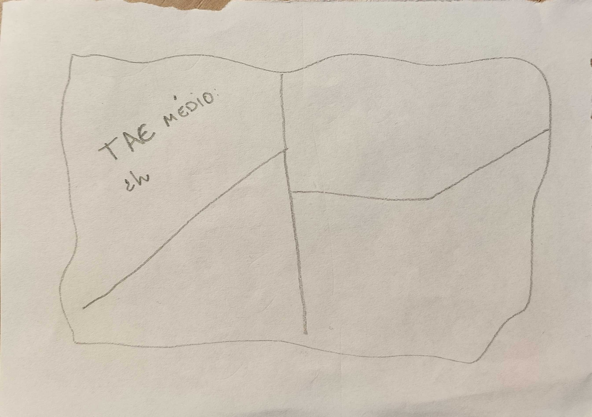
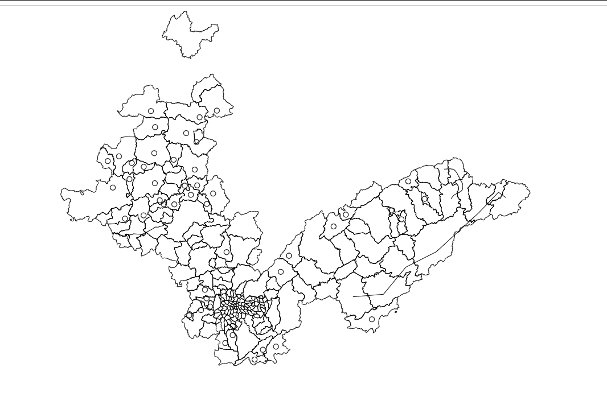

Este projeto é um código HTML que utiliza a biblioteca D3.js para carregar vários arquivos GeoJSON, combiná-los e exibir um mapa de todas as zonas no navegador. Nossa ideia principal é mapear as zonas e exibir os dados de cada uma delas, como o TAE (Tempo de espera para o gasista chegar ao local) e o número de chamadas de emergência. No entanto, não deu tempo de desenvolver tudo isso. Então, ele apenas aparece as zonas no mapa com o D3.js.

**Rascunho do projeto:**

**Resultado final:**

- **Objetivo:**  
   Carregar e juntar dados geográficos de múltiplos arquivos GeoJSON para renderizar um mapa usando SVG.

- **Como Funciona:**

  - Define uma lista fixa com os caminhos dos arquivos GeoJSON.
  - Usa `d3.json()` junto com `Promise.all()` para carregar todos os arquivos de forma assíncrona.
  - Combina os dados (features) de cada arquivo em um único objeto GeoJSON.
  - Cria um elemento SVG e renderiza o mapa aplicando uma projeção geográfica.

- **Requisitos:**

  - Navegador moderno.
  - Ter o NodeJS instalado
  - Instalar as dependências (rodar o comando npm install na pasta do projeto)

Para rodar o projeto, basta digitar “npm run dev” com esse comando e ele escutando atualização dos arquivos

O projeto seria ideal para os gestores terem um controle em tempo real das zonas e controlarem o tempo para não levarem multas por atraso.
